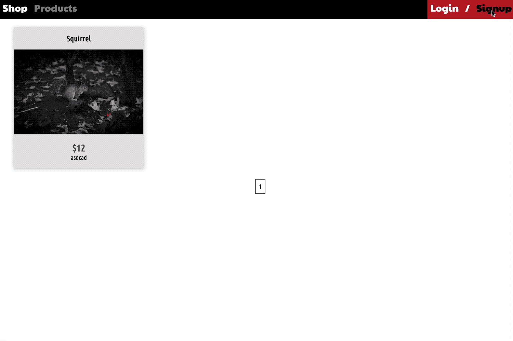
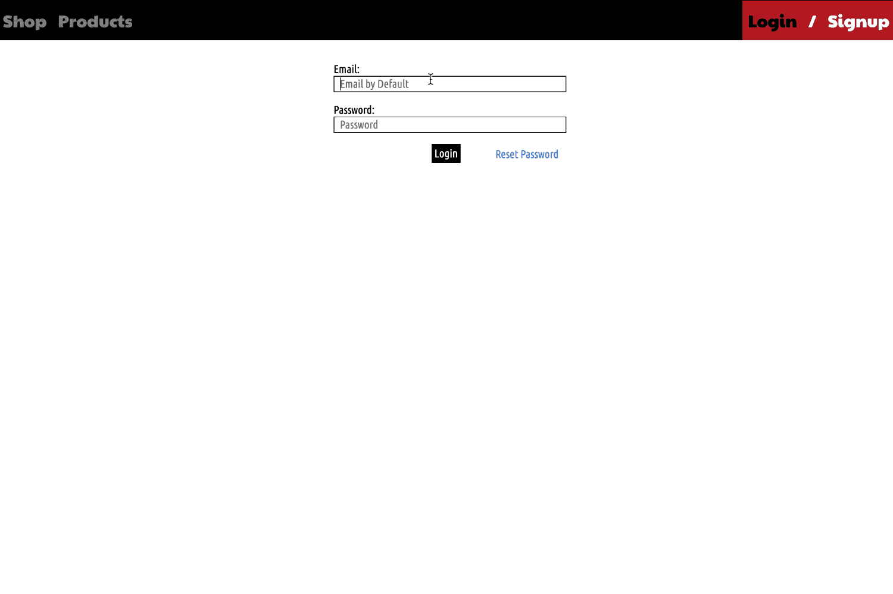
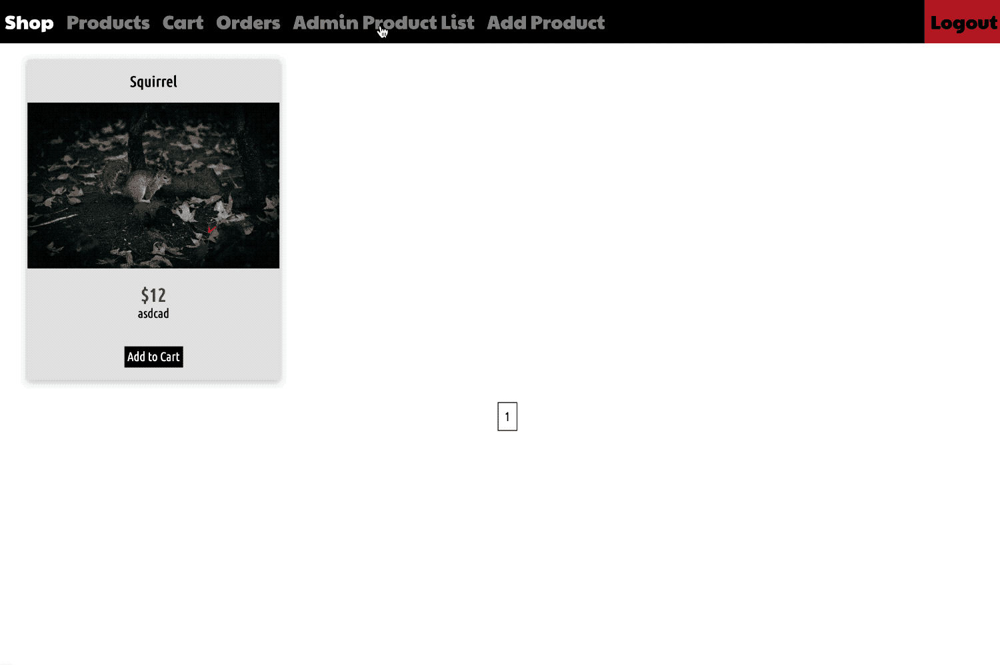
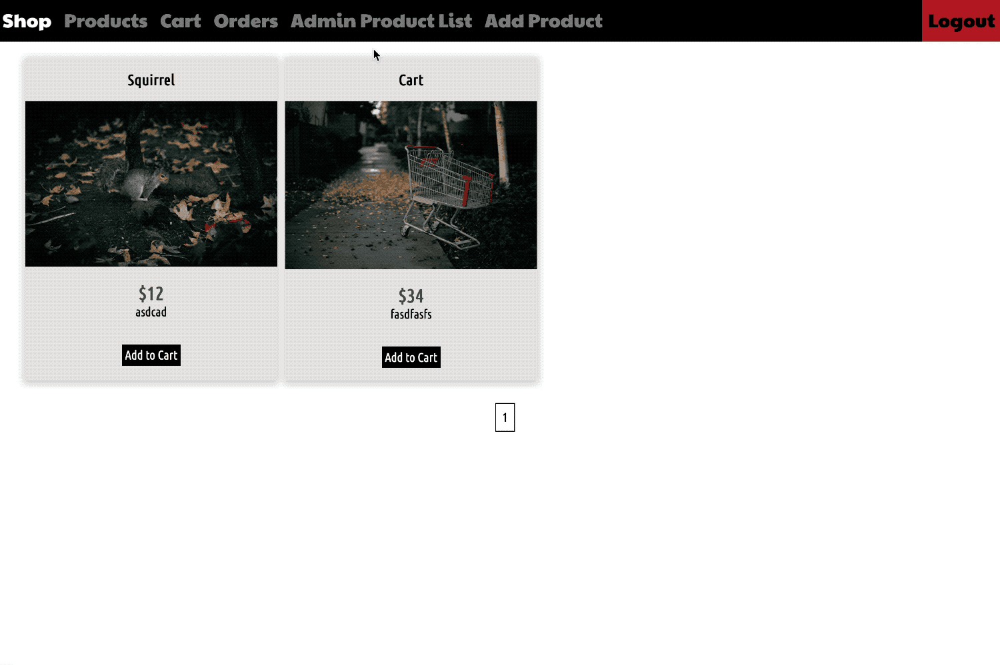
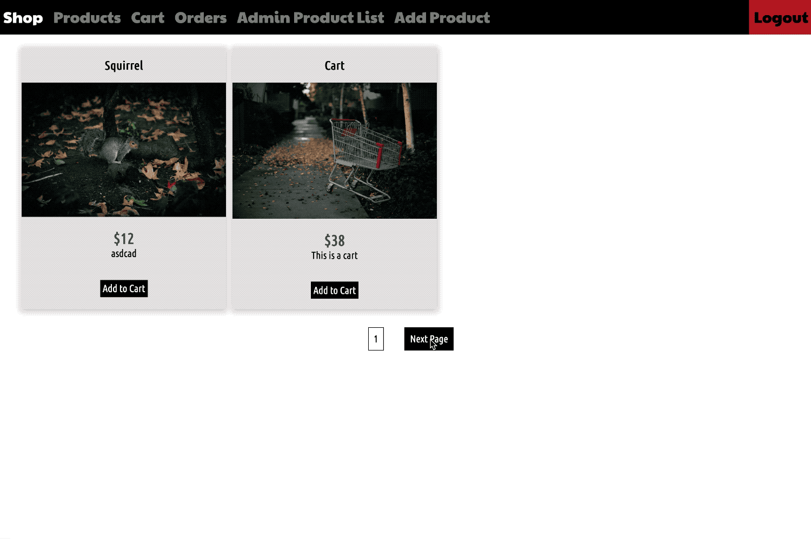
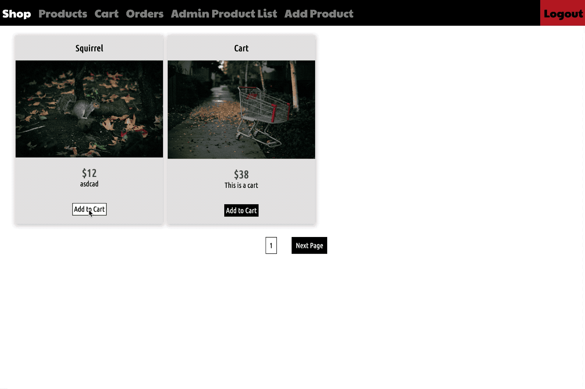
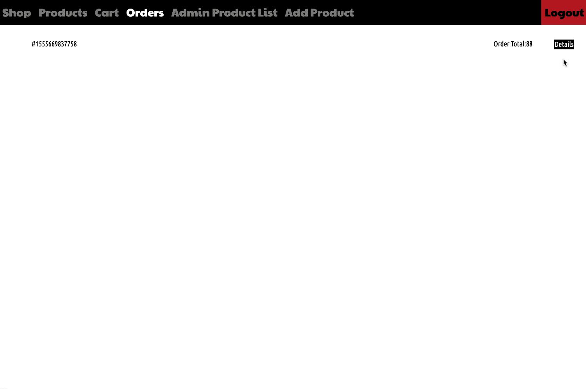

# ImageShop Sever Side Rendering Website

## API keys required

1. MongoDB Connection String in ./app.js
2. Sendgrid API Key in ./controllers/auth.js
3. Strip API Key in ./controllers/shop.js

## Installation and Run

After fill in API keys, under project root directory, install node modules

```bash
npm install
```

Run the following command to run the App

```bash
npm start
```

## Usage

### Signup with email notification support



### Temporary token based Reset



### Add Product



### Update Product



### Delete Product



### Purchase



### Support PDF invoice after payment


